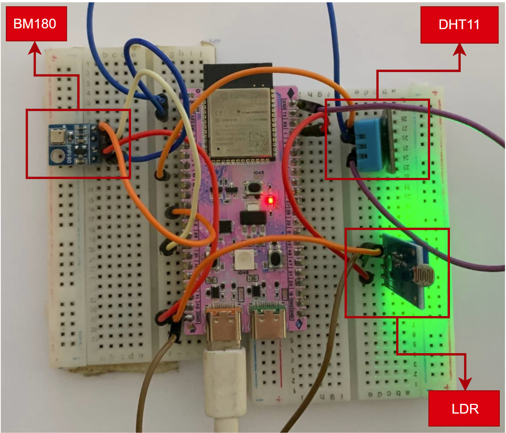
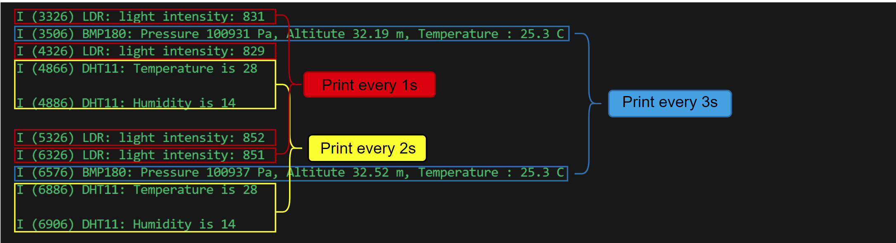

# _xTaskCreate_
FreeRTOS is an efficient, real-time operating system designed for embedded systems and microcontrollers. It is widely used in time-sensitive applications such as robotics, IoT devices, and various electronics. FreeRTOS helps manage tasks that need to execute within strict time limits, ensuring responsiveness and reliability.

For ESP32 chips, FreeRTOS is integrated into the ESP-IDF framework, enabling task management, process switching, and device interaction. It allows multiple tasks to run simultaneously while prioritizing them based on urgency, making it ideal for applications involving sensor data handling, communication, and other time-critical operations.

## Circuit Installation 

In this project, we will use three sensor such as DHT11 (Digital Sensor), LDR (Aanalog sensor) and BMP180 (I2C communication) by seperate task in different rate.

## Result from terminal

After flashing the code, here's the result:

According to the result above:
- The task of LDR prints the light intensity every one second regularly.
- The task of DHT11 prints the temperature and humidity at the same time in every two second.
- The task of BMP180 prints the pressure, altitude and temperature at the same time in three second.